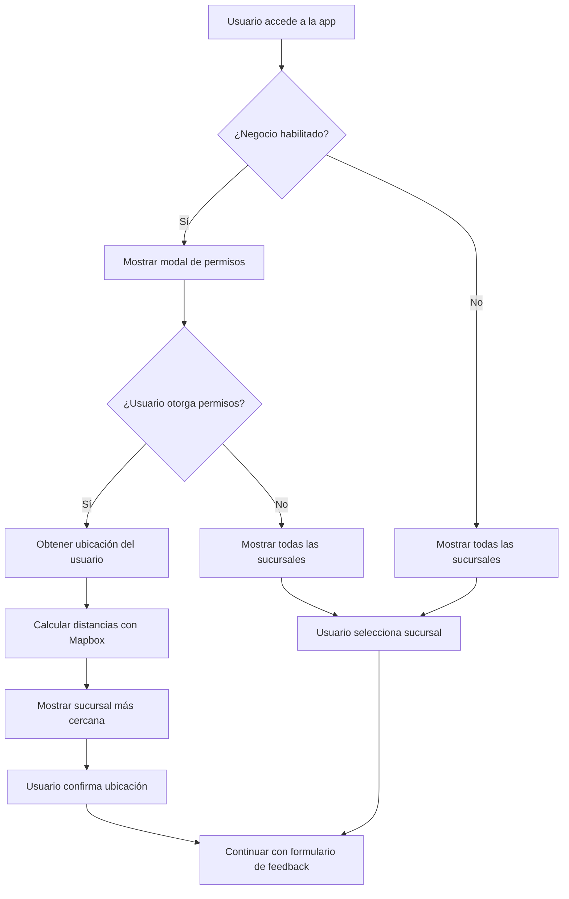

# Implementación de Geolocalización - Qik Feedback

## Tabla de Contenidos
- [Propósito y Contexto](#propósito-y-contexto)
- [Componentes Principales](#componentes-principales)
- [Flujo de Implementación](#flujo-de-implementación)
- [Almacenamiento de Datos](#almacenamiento-de-datos)
- [Configuración y APIs](#configuración-y-apis)
- [Casos de Uso Específicos](#casos-de-uso-específicos)
- [Experiencia de Usuario](#experiencia-de-usuario)
- [Beneficios de la Implementación](#beneficios-de-la-implementación)
- [Consideraciones Técnicas](#consideraciones-técnicas)

## Propósito y Contexto

La geolocalización se implementa para **mejorar la experiencia del usuario** al permitir que la aplicación identifique automáticamente la sucursal más cercana donde se encuentra el cliente, en lugar de mostrar todas las sucursales disponibles.

### Objetivos
- Reducir la carga cognitiva del usuario
- Identificar automáticamente la sucursal correcta
- Proporcionar una experiencia más personalizada
- Mantener flexibilidad para selección manual

## Componentes Principales

### A. Hook `useDistanceMatrix` 
**Archivo**: `app/hooks/useDistanceMatrix.tsx`

**Función**: Calcula la distancia entre la ubicación del usuario y las sucursales del negocio

**Tecnología**: Utiliza **Mapbox API** para cálculos de distancia

**Lógica Principal**:
```typescript
// Cálculo de la sucursal más cercana
const minDistance: number = Math.min(...distances[0]);
setClosestDestination(destinations[distances[0].indexOf(minDistance)]);
```

**Características**:
- Recibe coordenadas de origen (usuario) y destinos (sucursales)
- Usa el servicio Matrix de Mapbox para calcular distancias
- Retorna la sucursal más cercana basada en la distancia mínima
- Maneja errores de API y casos sin ruta

### B. Componente `RequestLocationDialog`
**Archivo**: `app/components/RequestLocationDialog.tsx`

**Función**: Modal que solicita permisos de ubicación al usuario

**Estados del Modal**:
- `grantPermissions`: Solicita permiso de ubicación
- `suggestedLocations`: Muestra sucursales sugeridas

**Opciones del Usuario**:
- **"Compartir ubicación"**: Activa geolocalización
- **"Ver sucursales"**: Muestra todas las sucursales sin geolocalización

**Características**:
- Interfaz intuitiva con iconos y mensajes claros
- Animaciones de transición suaves
- Manejo de estados de carga durante la obtención de permisos

### C. Componente Principal `FeedbackFormRoot`
**Archivo**: `app/components/FeedbackFormRoot.tsx`

**Función**: Coordina toda la lógica de geolocalización

**Estados Clave**:
```typescript
const [locationPermission, setLocationPermission] = useState(false);
const [originPosition, setOriginPosition] = useState<{
  latitude: number | null;
  longitude: number | null;
}>({ latitude: null, longitude: null });
const [closestDestination, setClosestDestination] = useState<Branch>();
const [requestLocation, setRequestLocation] = useState(false);
```

## Flujo de Implementación

### Paso 1: Verificación de Habilitación
```typescript
const enableGeolocation = [
  CUSTOM_HOOTERS_FORM_ID,
  CUSTOM_YOGURT_FORM_ID,
  CUSTOM_POLLOSDCAMPO_FORM_ID,
  CUSTOM_CEBICHES_FORM_ID,
  CUSTOM_INKA_BURGER_FORM_ID,
  CUSTOM_PIQUEOS_MORITOS_FORM_ID,
].includes(businessId ?? "");
```

### Paso 2: Solicitud de Permisos
```typescript
function getLocation() {
  setGrantingPermissions(true);
  if (navigator.geolocation) {
    navigator.geolocation.getCurrentPosition(
      grantPositionPermission,    // Éxito
      denyPositionPermission      // Error/Denegado
    );
  }
}
```

### Paso 3: Manejo de Respuesta

#### Permiso Otorgado
```typescript
function grantPositionPermission(position: any) {
  setLocationPermission(true);
  setCookie("grantedLocation", "yes", 365);
  const origin = {
    latitude: position.coords.latitude,
    longitude: position.coords.longitude,
  };
  setOriginPosition(origin);
  setGrantingPermissions(false);
}
```

#### Permiso Denegado
```typescript
function denyPositionPermission() {
  setLocationPermission(false);
  setGrantingPermissions(false);
  setCookie("grantedLocation", "no", 365);
}
```

### Paso 4: Cálculo de Distancia
```typescript
useEffect(() => {
  if (originPosition.latitude && originPosition.longitude && business) {
    setDistanceMatrix({
      origin: originPosition,
      destinations: business?.sucursales?.concat(matrizInfo),
    });
  }
}, [originPosition, business, setDistanceMatrix]);
```

## Almacenamiento de Datos

### Estructura de Sucursales
**Archivo**: `app/types/business.ts`

```typescript
export interface Business {
  Geopoint?: { _lat: number; _long: number };
  HasGeolocation?: boolean;
  sucursales?: Branch[];
}
```

### Persistencia de Preferencias
- **Cookies**: Almacena si el usuario otorgó/denegó permisos (`grantedLocation`)
- **Duración**: 365 días
- **Firebase**: Las sucursales se almacenan con coordenadas geográficas

### Estructura de Datos en Firebase
```
businesses/
  └── {businessId}/
      ├── sucursales/
      │   └── {branchId}/
      │       ├── Geopoint: { _lat: number, _long: number }
      │       └── HasGeolocation: boolean
      └── HasGeolocation: boolean
```

## Configuración y APIs

### Variables de Entorno
**Archivo**: `app/constants/general.ts`

```typescript
const MAPBOX_API_KEY = process.env.NEXT_PUBLIC_MAPBOX_API_KEY
```

### Integración con Mapbox
- **Servicio**: Matrix API de Mapbox
- **Perfil**: `driving` (cálculo basado en rutas de conducción)
- **Anotaciones**: `distance` y `duration`
- **Configuración**:
```typescript
const response = await matrixService.getMatrix({
  points: points,
  sources: [0],
  destinations: destinationsPoints,
  profile: "driving",
  annotations: ["distance", "duration"],
}).send();
```

## Casos de Uso Específicos

### Negocios Habilitados
La geolocalización está habilitada para:
- **Hooters** (`CUSTOM_HOOTERS_FORM_ID`)
- **Yogurt Amazonas** (`CUSTOM_YOGURT_FORM_ID`)
- **Pollos del Campo** (`CUSTOM_POLLOSDCAMPO_FORM_ID`)
- **Los Cebiches de la Rumiñahui** (`CUSTOM_CEBICHES_FORM_ID`)
- **Inka Burger** (`CUSTOM_INKA_BURGER_FORM_ID`)
- **Piqueos y Moritos** (`CUSTOM_PIQUEOS_MORITOS_FORM_ID`)

### Comportamiento Condicional
```typescript
const getBranchesListByPermission = () => {
  const branchesPlusBrand = business?.sucursales ?? [];
  const matrizInfo = business ? [business as Branch] : [];
  return locationPermission
    ? getBestOption()           // Solo sucursal más cercana
    : branchesPlusBrand.concat(matrizInfo); // Todas las sucursales
};
```

## Experiencia de Usuario

### Flujo de Usuario

1. **Primera Visita**
   - Modal aparece solicitando permisos de ubicación
   - Usuario puede elegir "Compartir ubicación" o "Ver sucursales"

2. **Con Permisos Otorgados**
   - Aplicación obtiene coordenadas del usuario
   - Calcula distancia a todas las sucursales
   - Muestra solo la sucursal más cercana
   - Usuario confirma su ubicación

3. **Sin Permisos o Denegados**
   - Muestra todas las sucursales disponibles
   - Usuario selecciona manualmente su sucursal

4. **Persistencia**
   - Recuerda la preferencia del usuario (365 días)
   - No vuelve a solicitar permisos en futuras visitas

### Estados de la Interfaz

| Estado | Descripción | Acción del Usuario |
|--------|-------------|-------------------|
| `grantPermissions` | Solicita permisos de ubicación | Elegir compartir o ver todas |
| `suggestedLocations` | Muestra sucursales sugeridas | Confirmar ubicación |
| `grantingPermissions` | Obteniendo ubicación | Esperar (loading) |

## Beneficios de la Implementación

### Para el Usuario
- **UX Mejorada**: Reduce la carga cognitiva al mostrar solo opciones relevantes
- **Precisión**: Identifica automáticamente la sucursal correcta
- **Flexibilidad**: Permite fallback a selección manual
- **Privacidad**: Respeta la decisión del usuario sobre compartir ubicación

### Para el Negocio
- **Analytics**: Permite análisis de patrones de ubicación
- **Precisión de Datos**: Mejora la calidad de los datos de feedback
- **Eficiencia**: Reduce errores de selección de sucursal

### Técnicos
- **Performance**: Reduce la cantidad de opciones mostradas
- **Escalabilidad**: Funciona con múltiples sucursales
- **Mantenibilidad**: Código modular y bien estructurado

## Consideraciones Técnicas

### Manejo de Errores
```typescript
if (response.body.code === "NoRoute") {
  console.error("There is origin but for the distance routes were not found.");
  return;
}
```

### Fallbacks
- **Sin soporte de geolocalización**: Muestra todas las sucursales
- **Error de API**: Fallback a selección manual
- **Permisos denegados**: Continúa con flujo normal

### Compatibilidad
- **Verificación de soporte**: `navigator.geolocation` check
- **Navegadores modernos**: Funciona en todos los navegadores modernos
- **Dispositivos móviles**: Optimizado para móviles

### Performance
- **Cálculos asíncronos**: Los cálculos de distancia no bloquean la UI
- **Caching**: Las preferencias se almacenan en cookies
- **Lazy loading**: Componentes se cargan bajo demanda

### Seguridad y Privacidad
- **Consentimiento explícito**: Usuario debe otorgar permisos
- **Persistencia de preferencias**: Respeta la decisión del usuario
- **Datos mínimos**: Solo almacena coordenadas necesarias

## Arquitectura del Sistema



## Conclusión

Esta implementación de geolocalización es sofisticada y está bien integrada en el flujo de la aplicación. Utiliza tecnologías modernas (Mapbox API) y sigue buenas prácticas de UX al ofrecer opciones claras al usuario y respetar sus preferencias de privacidad. La arquitectura modular permite fácil mantenimiento y extensión para futuros negocios.
