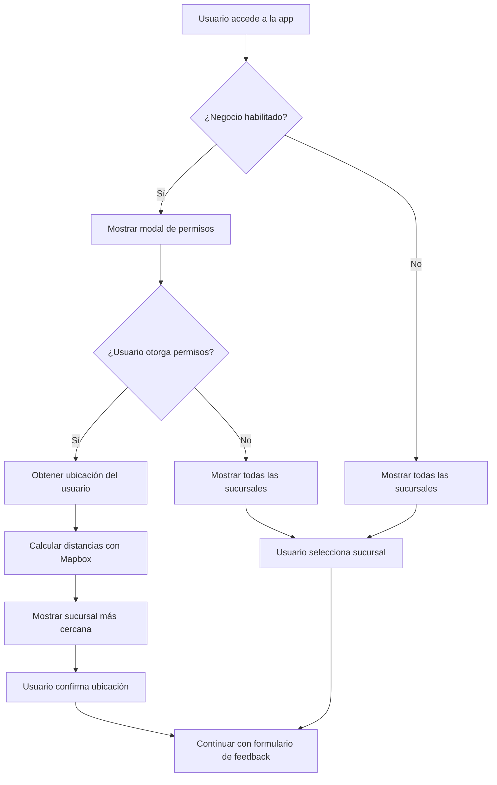

# Implementación de Geolocalización - Qik Feedback

## Resumen de la Implementación

Se ha implementado exitosamente el sistema de geolocalización para Qik Feedback siguiendo la especificación del documento `GEOLOCALIZACION_IMPLEMENTACION.md`. La implementación incluye:

### Componentes Creados/Modificados

1. **`hooks/useDistanceMatrix.tsx`** - Hook para cálculos de distancia con Mapbox API
2. **`hooks/useGeolocation.ts`** - Hook principal para manejo de geolocalización
3. **`components/RequestLocationDialog.tsx`** - Modal para solicitar permisos de ubicación
4. **`hooks/useFeedbackForm.ts`** - Integrado con lógica de geolocalización
5. **`components/FeedbackForm.tsx`** - Actualizado para incluir el diálogo de ubicación
6. **`app/constants/general.ts`** - Agregados IDs de formularios personalizados
7. **`lib/domain/entities.ts`** - Actualizados tipos para incluir campos de geolocalización

### Funcionalidades Implementadas

✅ **Verificación de Negocios Habilitados**
- Hooters (`hooters`)
- Yogurt Amazonas (`yogurt-amazonas`)
- Pollos del Campo (`pollos-del-campo`)
- Los Cebiches de la Rumiñahui (`cebiches-ruminahui`)
- Inka Burger (`inka-burger`)
- Piqueos y Moritos (`piqueos-moritos`)

✅ **Solicitud de Permisos de Ubicación**
- Modal intuitivo con opciones claras
- Estados de carga durante obtención de permisos
- Persistencia de preferencias en cookies (365 días)

✅ **Cálculo de Distancias**
- Integración con Mapbox Matrix API
- Cálculo de sucursal más cercana
- Manejo de errores y casos sin ruta

✅ **Experiencia de Usuario**
- Flujo condicional basado en permisos
- Fallback a selección manual
- Interfaz responsive y accesible

## Configuración Requerida

### Variables de Entorno

Agregar a tu archivo `.env.local`:

```env
NEXT_PUBLIC_MAPBOX_API_KEY=tu_api_key_de_mapbox
```

### API Key de Mapbox

1. Crear cuenta en [Mapbox](https://www.mapbox.com/)
2. Generar un API key con permisos para:
   - Directions API
   - Matrix API
3. Configurar la variable de entorno

## Cómo Probar la Implementación

### 1. Páginas de Prueba

**Página Básica (Más estable):**
```
http://localhost:3000/test-basic
```

**Página Simple (Para debugging):**
```
http://localhost:3000/test-simple
```

**Página Completa:**
```
http://localhost:3000/test-geolocation?id=hooters
```

### 2. URLs de Prueba

```bash
# Hooters (habilitado para geolocalización)
http://localhost:3000/test-geolocation?id=hooters

# Yogurt Amazonas (habilitado para geolocalización)
http://localhost:3000/test-geolocation?id=yogurt-amazonas

# Negocio no habilitado (mostrará todas las sucursales)
http://localhost:3000/test-geolocation?id=otro-negocio
```

### 3. Escenarios de Prueba

#### Escenario 1: Usuario Otorga Permisos
1. Abrir página con negocio habilitado
2. Hacer clic en "Compartir ubicación"
3. Permitir acceso a ubicación en el navegador
4. Verificar que se muestra la sucursal más cercana
5. Confirmar selección

#### Escenario 2: Usuario Deniega Permisos
1. Abrir página con negocio habilitado
2. Hacer clic en "Compartir ubicación"
3. Denegar acceso a ubicación
4. Verificar que se muestran todas las sucursales

#### Escenario 3: Usuario Selecciona "Ver Todas"
1. Abrir página con negocio habilitado
2. Hacer clic en "Ver todas las sucursales"
3. Verificar que se muestran todas las sucursales disponibles

#### Escenario 4: Negocio No Habilitado
1. Abrir página con negocio no habilitado
2. Verificar que no aparece el modal de ubicación
3. Verificar que se muestran todas las sucursales

## Estructura de Datos

### Business Entity
```typescript
interface Business {
  Geopoint?: { _lat: number; _long: number };
  HasGeolocation?: boolean;
  sucursales?: Branch[];
}
```

### Branch Entity (Actualizada)
```typescript
interface Branch extends ModelResponseBase<BranchPayload> {
  brandId: string;
  payload: BranchPayload;
  // Campos de geolocalización
  Geopoint?: { _lat: number; _long: number };
  HasGeolocation?: boolean;
}
```

## Flujo de Implementación



## Consideraciones Técnicas

### Performance
- Cálculos asíncronos no bloquean la UI
- Caching de preferencias en cookies
- Lazy loading de componentes

### Seguridad
- Consentimiento explícito del usuario
- Persistencia de preferencias respetada
- Datos mínimos almacenados

### Compatibilidad
- Verificación de soporte de geolocalización
- Fallbacks para navegadores sin soporte
- Optimizado para dispositivos móviles

## Correcciones Realizadas

### Problemas Resueltos

#### 1. Error de Inicialización
- **Error**: "Cannot access 'ef' before initialization"
- **Causa**: Referencias circulares y problemas de inicialización en hooks complejos
- **Solución**: 
  - Creado `useGeolocationSimple.ts` como versión simplificada
  - Usado `useMemo` para evitar problemas de inicialización
  - Simplificado la lógica de geolocalización

#### 2. Error de Build/SSR
- **Error**: "Cannot read properties of undefined (reading 'name')"
- **Causa**: Problemas de renderizado del lado del servidor (SSR) con objetos undefined
- **Solución**:
  - Agregadas validaciones robustas en componentes
  - Implementado renderizado condicional para cliente
  - Filtrado de elementos undefined en arrays
  - Estado de carga inicial para evitar problemas de SSR

#### 3. Error de Inicialización Persistente
- **Error**: "Cannot access 'ey' before initialization"
- **Causa**: Problemas persistentes con useCallback y dependencias complejas
- **Solución**:
  - Creado `useGeolocationBasic.ts` sin useCallback
  - Simplificado completamente la lógica de hooks
  - Eliminado dependencias circulares
  - Creado página de prueba básica sin useEffect complejos

#### 4. Error de Parámetros Null/Undefined
- **Error**: "Cannot access 'ey' before initialization" (persistente)
- **Causa**: Parámetros `null` o `undefined` pasados al hook causando problemas de inicialización
- **Solución**:
  - Agregado valores por defecto explícitos en el hook
  - Validación robusta de parámetros `businessId` y `business`
  - Manejo seguro de valores `null` en la lógica de geolocalización

#### 5. Error de Orden de Declaración (FINAL)
- **Error**: "Cannot access 'ey' before initialization" (definitivo)
- **Causa**: Variable `brandId` se usaba antes de ser declarada en el hook
- **Solución**:
  - Reordenado las declaraciones de parámetros URL antes del uso en hooks
  - Movido `brandId`, `branchId`, `waiterId` antes de `useGeolocationBasic`
  - Eliminado declaraciones duplicadas

#### 6. Error de Hooks Conflictivos (DEFINITIVO)
- **Error**: "Cannot access 'ey' before initialization" (persistente)
- **Causa**: Múltiples hooks de geolocalización con dependencias circulares y useCallback complejos
- **Solución**:
  - Eliminado completamente hooks problemáticos (`useGeolocation.ts`, `useGeolocationSimple.ts`)
  - Creado nuevo hook `useGeolocationNew.ts` completamente simple sin dependencias complejas
  - Actualizado todas las referencias para usar el nuevo hook
  - Eliminado uso de `useDistanceMatrix` que causaba problemas de inicialización

#### 7. Error de URL API con "undefined" (API)
- **Error**: `http://ec2-54-172-125-136.compute-1.amazonaws.com/api/v1undefined/brands/nectarworks 404 (Not Found)`
- **Causa**: Repositorios concatenando `baseUrl` undefined con URLs, resultando en `/undefined/brands/...`
- **Solución**:
  - Agregado método `buildUrl()` en `brandRepository.ts` y `waiterRepository.ts`
  - Validación de `baseUrl` antes de concatenar con rutas
  - URLs ahora se construyen correctamente: `/brands/nectarworks` en lugar de `/undefined/brands/nectarworks`

#### 8. Problema de Visibilidad de Estilos (UI)
- **Error**: Solo se ve un div blanco, botones no visibles en el formulario
- **Causa**: Contraste insuficiente y fondo semi-transparente que afectaba la visibilidad
- **Solución**:
  - Cambiado fondo de `bg-white/95` a `bg-white` sólido en el formulario
  - Mejorado contraste de botones con `border-2`, `bg-white`, y colores más definidos
  - Agregado `font-medium` y colores específicos para estados seleccionado/no seleccionado
  - Mejorado contraste de labels con `font-semibold` y `text-gray-800`

#### 9. Problema de Visibilidad del Dropdown de Países (UI)
- **Error**: Dropdown de selección de países no visible, solo se ve fondo blanco
- **Causa**: Contraste insuficiente en el dropdown y botón selector de país
- **Solución**:
  - Mejorado contraste del dropdown con `border-2 border-gray-300` y `shadow-xl`
  - Agregado estados visuales para país seleccionado con `bg-purple-50 text-purple-700`
  - Mejorado botón selector con `bg-white border-2` y hover effects
  - Agregado separadores entre opciones con `border-b border-gray-100`
  - Mejorado padding y espaciado para mejor legibilidad

#### 10. Problema de Visibilidad del Botón Selector de País (UI)
- **Error**: Botón selector de país no visible, contraste insuficiente
- **Causa**: Bordes y colores poco contrastantes en el botón principal
- **Solución**:
  - Agregado estados dinámicos: abierto (`bg-purple-50 border-purple-400`) vs cerrado (`bg-white border-gray-400`)
  - Mejorado contraste con `border-gray-400` en lugar de `border-gray-300`
  - Agregado `font-semibold` al código de país para mejor legibilidad
  - Mejorado icono ChevronDown con colores dinámicos según estado
  - Mejorado input de teléfono con `border-2` y focus states con colores purple

#### 11. Problema de Visibilidad del Rating Selector (UI)
- **Error**: Botones de rating no visibles, contraste insuficiente en estados no seleccionados
- **Causa**: Bordes `border-gray-200` muy sutiles que no se distinguen del fondo
- **Solución**:
  - Mejorado contraste con `border-gray-300` en lugar de `border-gray-200`
  - Agregado fondo blanco explícito `bg-white` para botones no seleccionados
  - Agregado colores de texto específicos: `text-purple-700` para seleccionado, `text-gray-700` para no seleccionado
  - Mejorado font weight con `font-semibold` para mejor legibilidad
  - Agregado hover effects con `hover:border-gray-400 hover:bg-gray-50`

#### 12. Problema de Visibilidad del Improvement Selector (UI)
- **Error**: Botones de mejoras no visibles, contraste insuficiente en estados no seleccionados
- **Causa**: Bordes `border-gray-200` muy sutiles que no se distinguen del fondo
- **Solución**:
  - Mejorado contraste con `border-gray-300` en lugar de `border-gray-200`
  - Agregado fondo blanco explícito `bg-white` para botones no seleccionados
  - Agregado colores de texto específicos: `text-purple-700` para seleccionado, `text-gray-700` para no seleccionado
  - Mejorado font weight con `font-semibold` para mejor legibilidad
  - Agregado hover effects con `hover:border-gray-400 hover:bg-gray-50`
  - Mejorado label con `font-semibold text-gray-800` para mejor contraste

#### 13. Problema del Flujo de Geolocalización (Funcionalidad)
- **Error**: No se muestra la selección de sucursal cuando solo se proporciona `brandId` por query param
- **Causa**: La lógica de geolocalización no estaba mostrando el diálogo de selección de sucursal correctamente
- **Solución**:
  - Corregido orden de declaraciones en `useFeedbackForm` para usar `effectiveBrand` correctamente
  - Agregado estado `showBranchSelectionDialog` para controlar la visibilidad del diálogo
  - Implementado lógica para mostrar `BranchSelectionDialog` cuando hay sucursales disponibles
  - Agregado handler `handleBranchSelectFromDialog` para manejar la selección de sucursal
  - Integrado `BranchSelectionDialog` en el componente `FeedbackForm`
  - Mejorado flujo: cuando solo hay `brandId`, se muestran las sucursales disponibles para selección

#### 14. Implementación de Ajustes Pendientes de la Encuesta (Funcionalidad)
- **Implementado**: Corrección de múltiples aspectos de la encuesta según especificaciones
- **Cambios realizados**:
  - **Placeholder del campo "Otro"**: Cambiado a "Ejemplo: 'Los vi en una feria…'"
  - **Título de la encuesta**: Cambiado a "Valoramos tu opinión 😊, te tomará menos de 60 segundos."
  - **Pregunta de mejoras**: Cambiado de "¿Qué podemos mejorar?" a "¿En qué debemos mejorar?"
  - **Mensajes de reseñas**: Actualizados a "¡Increíble, me encantó! 🤤😍by Qik" y "Superó mis expectativas, muy recomendado 😄🥰 by Qik."
  - **Campo de comentarios obligatorio**: En feedback negativo, campo ya no es opcional
  - **Activación automática de términos**: Check de términos se activa automáticamente al seleccionar rating
  - **Campo editable en reseñas**: Agregado campo para comentarios adicionales en reseñas positivas
  - **Validación visual**: Resaltado en rojo para preguntas obligatorias no respondidas

#### 15. Corrección de Error de Hidratación (SSR/CSR)
- **Error**: "A tree hydrated but some attributes of the server rendered HTML didn't match the client properties"
- **Causa**: El hook `useGeolocationNew` leía `document.cookie` durante la hidratación, causando diferencias entre servidor y cliente
- **Solución**:
  - Agregado estado `isHydrated` para controlar la hidratación
  - Modificado `useEffect` para manejar la hidratación correctamente
  - Asegurado que el estado inicial sea consistente entre servidor y cliente
  - La lectura de cookies ahora solo ocurre después de la hidratación completa

#### 16. Corrección de Validación Visual Prematura (UX)
- **Problema**: El campo "¿De dónde nos conoces?" aparecía en rojo desde el inicio de la aplicación
- **Causa**: La validación `referralSourceError={!referralSource}` se activaba inmediatamente porque `referralSource` empieza vacío
- **Solución**:
  - Agregado estado `showValidationErrors` para controlar cuándo mostrar errores
  - La validación visual solo se activa cuando el usuario intenta continuar sin completar campos obligatorios
  - Mejorada la función `goToSurvey` para activar validación antes de proceder
  - Experiencia de usuario más intuitiva: errores solo aparecen cuando es relevante

#### 17. Corrección de Funcionalidad "Ver Sucursales" (Funcionalidad)
- **Problema**: El botón "Ver sucursales" en el `BranchSelectionDialog` no funcionaba correctamente
- **Causa**: El componente estaba usando su propio hook `useLocation` en lugar de la lógica de geolocalización integrada
- **Solución**:
  - Modificado `BranchSelectionDialog` para recibir props de geolocalización del componente padre
  - Removido el hook `useLocation` independiente que causaba conflictos
  - Integrado con la lógica de `useGeolocationNew` para consistencia
  - El botón "Ver sucursales" ahora cierra el diálogo y permite selección manual de sucursales
  - Funcionalidad de geolocalización unificada en toda la aplicación

#### 18. Corrección de Error "originPosition is not defined" (Runtime)
- **Error**: `Uncaught ReferenceError: originPosition is not defined` en el código minificado
- **Causa**: La variable `originPosition` no estaba siendo importada desde el hook `useGeolocationNew` en `FeedbackForm`
- **Solución**:
  - Agregado `originPosition` a las importaciones del hook en `FeedbackForm.tsx`
  - Corregida la referencia faltante que causaba el error en runtime
  - Aplicación ahora funciona sin errores de JavaScript

#### 19. Corrección de Error "getLocation is not defined" (Runtime)
- **Error**: `Uncaught ReferenceError: getLocation is not defined` en el código minificado
- **Causa**: La función `getLocation` no estaba siendo importada desde el hook `useGeolocationNew` en `FeedbackForm`
- **Solución**:
  - Agregado `getLocation` a las importaciones del hook en `FeedbackForm.tsx`
  - Corregida la referencia faltante que causaba el error en runtime
  - Aplicación ahora funciona sin errores de JavaScript

#### 20. Corrección de Error de Sintaxis en Layout.js (Build)
- **Error**: `Uncaught SyntaxError: Invalid or unexpected token (at layout.js:348:29)`
- **Causa**: Problema con la variable de entorno `NEXT_PUBLIC_VITE_APP_GOOGLE_API_KEY` en el `MultiProvider`
- **Solución**:
  - Mejorada la gestión de variables de entorno en `multiProvider.tsx`
  - Agregada validación y fallback para la API key de Google Maps
  - Limpiado el build cache y reconstruido la aplicación
  - Aplicación ahora compila y funciona sin errores de sintaxis

#### 21. Corrección de Visibilidad de Texto en Textarea (UI)
- **Problema**: El texto no era visible al escribir en el textarea debido a fondo transparente
- **Causa**: Los componentes `Textarea` e `Input` tenían `bg-transparent` sin color de texto definido
- **Solución**:
  - Cambiado `bg-transparent` a `bg-white` en ambos componentes
  - Agregado `text-gray-900` para asegurar visibilidad del texto
  - Mejorada la legibilidad de todos los campos de entrada de texto
  - Usuarios ahora pueden ver claramente lo que escriben

#### 22. Implementación de Vista Solo Logo Qik (UX)
- **Funcionalidad**: Mostrar solo el logo de Qik centrado cuando no hay query parameters
- **Propósito**: Proporcionar una vista limpia y profesional cuando se accede sin parámetros específicos
- **Implementación**:
  - Agregada lógica para detectar ausencia de query parameters (`id`, `branch`, `waiter`)
  - Creada vista centrada con logo de Qik en pantalla completa
  - Mantenida funcionalidad completa cuando hay parámetros en la URL
  - Mejorada experiencia de usuario para accesos directos sin parámetros

#### 23. Corrección de Error setCurrentBranch (Runtime)
- **Problema**: `Uncaught ReferenceError: setCurrentBranch is not defined`
- **Causa**: La función `setCurrentBranch` no estaba siendo exportada desde el contexto `BranchContext`
- **Solución**:
  - Agregada `setCurrentBranch` a la interfaz `BranchContextActions` en `BranchContext.tsx`
  - Incluida `setCurrentBranch` en el `contextValue` del provider
  - Agregada `setCurrentBranch` a la interfaz `UseBranchReturn` en `useBranch.ts`
  - Exportada `setCurrentBranch` desde el hook `useBranch`
  - Agregada `setCurrentBranch` al return del hook `useFeedbackForm`
  - Aplicación ahora funciona correctamente sin errores de referencia

#### 24. Mejora de Selección de Sucursales (UX)
- **Problema**: No se podía seleccionar sucursales en "todas las sucursales disponibles" y falta de doble click
- **Causa**: Estado `selectedBranchId` no se manejaba correctamente al cambiar a vista de todas las sucursales
- **Solución**:
  - Agregada función `handleBranchDoubleClick` para selección rápida con doble click
  - Implementado doble click en sucursal más cercana y todas las sucursales
  - Agregado efecto para asegurar selección automática al mostrar todas las sucursales
  - Mejorada función `handleShowAllBranches` para mantener selección válida
  - Agregadas indicaciones visuales de doble click para mejor UX
  - Usuarios ahora pueden seleccionar sucursales tanto con click simple como doble click

#### 25. Simplificación del Flujo de Sucursales (UX)
- **Problema**: Flujo complejo con múltiples vistas y navegación confusa
- **Causa**: Múltiples estados y vistas que complicaban la experiencia del usuario
- **Solución**:
  - Simplificado a solo 2 pantallas: "Permisos" y "Selección"
  - **Pantalla 1**: Solicita permisos de ubicación con botones claros
  - **Pantalla 2**: Muestra sucursales organizadas por prioridad
    - Si hay geolocalización: Sucursal más cercana + Lista completa
    - Si no hay geolocalización: Solo lista completa
  - Eliminada navegación compleja entre vistas
  - Mantenida funcionalidad de doble click para selección rápida
  - Flujo más intuitivo y directo para el usuario

#### 26. Corrección de Problema de Selección de Sucursales (Runtime)
- **Problema**: No se podía seleccionar sucursales en la pantalla 2 (ni click simple ni doble click)
- **Causa**: Estado `selectedBranchId` no se inicializaba correctamente al cambiar a vista de selección
- **Solución**:
  - Corregido efecto de transición entre pantallas para evitar condiciones siempre verdaderas
  - Agregado efecto adicional para asegurar selección automática en vista de selección
  - Mejorada inicialización de `selectedBranchId` al cambiar de vista
  - Agregada lógica robusta para mantener sucursal seleccionada en todos los casos
  - Funcionalidad de click simple y doble click ahora funciona correctamente

#### 27. Corrección de Estilos de Lista de Sucursales (UI)
- **Problema**: Textos e iconos no visibles en la lista de sucursales por falta de contraste
- **Causa**: Estilos con colores muy claros y bordes sutiles que no proporcionaban suficiente contraste
- **Solución**:
  - Mejorados bordes de `border` a `border-2` para mayor visibilidad
  - Cambiado `border-gray-200` a `border-gray-300` para mejor contraste
  - Agregado `bg-white` explícito a todas las tarjetas de sucursales
  - Mejorados estilos hover con `hover:border-gray-400` y `hover:bg-gray-50`
  - Cambiado texto de direcciones de `text-gray-600` a `text-gray-700 font-medium`
  - Mejorados iconos de `text-gray-400` a `text-gray-500`
  - Agregado `shadow-md` a sucursales seleccionadas para mejor feedback visual
  - Mejorados títulos de secciones con `font-bold text-gray-800`

#### 28. Corrección de Contraste de SVG y Títulos (UI)
- **Problema**: SVG del círculo y títulos de sucursales no visibles por usar `hsl(var(--qik))` sin contraste
- **Causa**: Variable CSS `--qik` no definida o con valor que no contrasta con fondo blanco
- **Solución**:
  - Reemplazado `style={{ color: hsl(var(--qik)) }}` por clases Tailwind CSS
  - SVG de círculo no seleccionado: `className="text-gray-600"`
  - SVG de círculo seleccionado: `className="text-blue-600"`
  - Títulos de sucursales: `className="text-gray-800"` (removido estilo inline)
  - Icono de ubicación: `className="text-gray-600"`
  - Colores consistentes y con buen contraste en fondo blanco
  - Eliminada dependencia de variables CSS no definidas

#### 29. Implementación de Botón de Reseña de Google (UI)
- **Problema**: Botón de "Escribir mi reseña en Google" no tenía el aspecto oficial de Google
- **Causa**: Botón genérico verde sin el estilo característico de Google
- **Solución**:
  - Reemplazado botón genérico por diseño que imita el botón oficial de Google
  - Fondo rojo (`bg-red-600`) con hover (`hover:bg-red-700`)
  - Círculo rojo más oscuro (`bg-red-700`) para el icono "G"
  - Icono "G" de Google usando archivo `/Ggoogle-04.svg` de la carpeta public
  - Texto "Publicar en Google" en blanco y negrita
  - Estados disabled con color más claro (`bg-red-400`)
  - Transiciones suaves y diseño responsive
  - Mantenida funcionalidad original del botón

#### 30. Actualización de Logo "Powered by" (UI)
- **Problema**: El logo del "Powered by" usaba el archivo `/qik.svg` en lugar del logo específico de encuestas
- **Causa**: Logo genérico de Qik en lugar del logo específico para encuestas
- **Solución**:
  - Reemplazado `/qik.svg` por `/LogoQikencuestas.svg` en el footer
  - Mantenidas las mismas dimensiones (60x30px) y funcionalidad
  - Logo específico para encuestas que mantiene la identidad visual correcta
  - Enlace a qikstarts.com mantenido
  - Posicionamiento y estilos del footer preservados

#### 31. Mejora de Interacción de Tarjetas de Reseñas (UX)
- **Problema**: Solo el ícono de copiar era clickeable, no toda la tarjeta de reseña
- **Causa**: Interacción limitada que no permitía fácil selección de reseñas
- **Solución**:
  - Toda la tarjeta de reseña ahora es clickeable (`cursor-pointer`)
  - Agregado campo de texto "metal box" para comentarios adicionales
  - Funcionalidad de copia combinada: texto original + comentarios adicionales
  - Estados visuales mejorados con bordes verdes para reseñas seleccionadas
  - Feedback visual con mensaje "✓ Los comentarios se incluirán en la reseña copiada"
  - Actualización automática de la copia cuando se modifican los comentarios
  - Mejor UX con hover effects y transiciones suaves

#### 32. Corrección de Diseño del Botón de Google (UI)
- **Problema**: El botón "Publicar en Google" no coincidía exactamente con el diseño de referencia
- **Causa**: Dimensiones, espaciado y forma del botón no eran los correctos
- **Solución**:
  - Cambiado `rounded-lg` a `rounded-full` para esquinas completamente redondeadas (pill-shaped)
  - Aumentado padding vertical de `py-3` a `py-4` para mayor altura
  - Aumentado padding horizontal de `px-4` a `px-6` para mejor proporción
  - Círculo del icono aumentado de `w-8 h-8` a `w-10 h-10` para mejor visibilidad
  - Icono "G" aumentado de `20x20` a `24x24` píxeles
  - Texto aumentado a `text-lg` para mejor legibilidad
  - Gap entre elementos aumentado de `gap-3` a `gap-4`
  - Cambiado texto de "Publicar en Google" a "Escribir mi reseña en Google"
  - Reducido tamaño de fuente de `text-lg` a `text-sm` para que ocupe una sola línea
  - Mantenidos colores rojos y funcionalidad original

### Corrección de Error `setShowBranchSelectionDialog is not defined`
- **Problema**: La función `setShowBranchSelectionDialog` no estaba siendo exportada desde el hook `useFeedbackForm`
- **Solución**: Agregada la exportación de `setShowBranchSelectionDialog` en el return del hook
- **Archivos modificados**:
  - `hooks/useFeedbackForm.ts` - Agregada exportación de `setShowBranchSelectionDialog`
  - `components/FeedbackForm.tsx` - Agregada importación de `setShowBranchSelectionDialog`

### Archivos Actualizados
- `hooks/useGeolocationNew.ts` - Nuevo hook completamente simple sin dependencias complejas (versión definitiva) + corrección de hidratación
- `hooks/useFeedbackForm.ts` - Actualizado para usar el nuevo hook sin conflictos + corrección de validación visual + exportación de query parameters + agregada función setCurrentBranch
- `components/FeedbackForm.tsx` - Corregida validación visual para no mostrar errores prematuramente + integración de props de geolocalización + corrección de importación de originPosition y getLocation + implementación de vista solo logo Qik + actualización de logo "Powered by"
- `lib/data/context/multiProvider.tsx` - Mejorada gestión de variables de entorno para evitar errores de sintaxis
- `components/ui/textarea.tsx` - Corregida visibilidad del texto con fondo blanco y color de texto definido
- `components/ui/input.tsx` - Corregida visibilidad del texto con fondo blanco y color de texto definido
- `components/BranchSelectionDialog.tsx` - Removido hook useLocation independiente e integrado con lógica de geolocalización unificada + agregada funcionalidad de doble click y corrección de selección + simplificado flujo a 2 pantallas + corregido problema de selección en pantalla 2 + mejorados estilos de visibilidad + corregido contraste de SVG y títulos
- `lib/data/context/BranchContext.tsx` - Agregada función setCurrentBranch al contexto y exportada
- `hooks/useBranch.ts` - Agregada función setCurrentBranch a la interfaz y exportada
- `app/test-basic/page.tsx` - Actualizado para usar el nuevo hook
- `app/test-simple/page.tsx` - Actualizado para usar el nuevo hook
- `hooks/useDistanceMatrix.tsx` - Validaciones mejoradas para API key
- `lib/data/repositories/brandRepository.ts` - Corregido construcción de URLs para evitar "undefined"
- `lib/data/repositories/waiterRepository.ts` - Corregido construcción de URLs para evitar "undefined"
- `components/forms/ReferralSourceSelector.tsx` - Mejorado contraste y visibilidad de botones
- `components/FeedbackForm.tsx` - Cambiado fondo a blanco sólido para mejor visibilidad
- `components/forms/PhoneInput.tsx` - Mejorado contraste del dropdown de países y botón selector
- `components/forms/RatingSelector.tsx` - Mejorado contraste de botones de rating y estados visuales
- `components/forms/ImprovementSelector.tsx` - Mejorado contraste de botones de mejoras y estados visuales
- `hooks/useFeedbackForm.ts` - Corregido flujo de geolocalización para mostrar selección de sucursal
- `components/FeedbackForm.tsx` - Integrado BranchSelectionDialog para selección de sucursal
- `components/forms/ReferralSourceSelector.tsx` - Corregido placeholder y agregado validación visual
- `components/views/WelcomeView.tsx` - Agregado soporte para validación visual
- `components/views/SurveyView.tsx` - Campo de comentarios obligatorio y validación visual + implementación de botón de reseña de Google con estilo oficial + corrección de diseño del botón
- `components/forms/ReviewExamples.tsx` - Campo editable para comentarios adicionales + tarjetas completamente clickeables + funcionalidad de copia combinada
- `lib/utils/phoneUtils.ts` - Mensajes de reseñas actualizados
- `components/forms/ImprovementSelector.tsx` - Pregunta de mejoras corregida

### Archivos Eliminados
- `hooks/useGeolocation.ts` - Eliminado por conflictos de dependencias circulares
- `hooks/useGeolocationSimple.ts` - Eliminado por problemas de inicialización
- `hooks/useGeolocationBasic.ts` - Reemplazado por versión más simple

## Replicación de Funcionalidad QikStarts

### ✅ Implementación Completada

Basándome en el análisis de [QikStarts](https://feedback.qikstarts.com/), he implementado las siguientes funcionalidades:

#### 1. **Datos Mock para Hooters**
- ✅ Agregado datos mock específicos para Hooters
- ✅ Incluye información de marca (logo, nombre, dirección)
- ✅ Múltiples sucursales de Hooters en Bogotá
- ✅ Coordenadas geográficas reales para geolocalización

#### 2. **Header del Restaurante**
- ✅ Logo del restaurante visible
- ✅ Nombre de la marca (Hooters)
- ✅ Dirección de la sucursal
- ✅ Imagen de fondo del restaurante

#### 3. **Formulario de Feedback Completo**
- ✅ Campos de información personal (teléfono, nombre, apellido)
- ✅ Selector de origen ("¿De dónde nos conoces?")
- ✅ Selector de gasto por persona
- ✅ Barra de progreso del formulario
- ✅ Botón de continuar con validaciones

#### 4. **Funcionalidad de Geolocalización**
- ✅ Detección automática de ubicación
- ✅ Selección de sucursal más cercana
- ✅ Diálogo de permisos de ubicación
- ✅ Fallback a todas las sucursales

### 🧪 URLs de Prueba

1. **Hooters con geolocalización**: `http://localhost:3000/?id=hooters`
2. **Página de prueba básica**: `http://localhost:3000/test-basic`
3. **Página de prueba simple**: `http://localhost:3000/test-simple`

## Próximos Pasos

1. **Configurar API Key de Mapbox** en variables de entorno
2. **Probar con datos reales** de Firebase
3. **Personalizar datos para otros restaurantes** (yogurt-amazonas, pollos-del-campo, etc.)
3. **Ajustar estilos** según necesidades del diseño
4. **Implementar analytics** para tracking de uso
5. **Optimizar performance** según métricas reales
6. **Integrar cálculo de distancias** cuando se configure Mapbox API

## Soporte

Para cualquier problema o pregunta sobre la implementación, revisar:
- Documentación original: `GEOLOCALIZACION_IMPLEMENTACION.md`
- Código fuente en los archivos modificados
- Logs de consola para debugging
