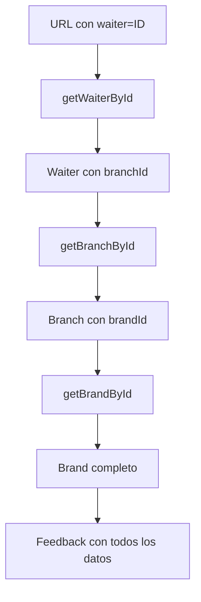

# 🍽️ Implementación del Parámetro Waiter en URL

## 📋 Resumen

Se ha implementado la funcionalidad para manejar el parámetro `waiter` en la URL del formulario de feedback. Cuando se proporciona un `waiterId`, el sistema automáticamente:

1. **Obtiene los datos del waiter** por su ID
2. **Extrae el `branchId`** del waiter
3. **Obtiene los datos de la sucursal** usando el `branchId`
4. **Extrae el `brandId`** de la sucursal
5. **Obtiene los datos de la marca** usando el `brandId`

Esto asegura que todos los datos necesarios estén disponibles para el feedback sin errores.

## 🔧 Cambios Implementados

### 1. **Modificación en `hooks/useFeedbackForm.ts`**

**Antes:**
```typescript
if (waiterId) {
  const fetchWaiterAndBranch = async () => {
    try {
      const waiter = await getWaiterById(waiterId);
      if (waiter) {
        setCurrentWaiter(waiter);
        await getBranchById(waiter.branchId);
      }
    } catch (error) {
      console.error("Error fetching waiter:", error);
    }
  };
  fetchWaiterAndBranch();
}
```

**Después:**
```typescript
if (waiterId) {
  const fetchWaiterBranchAndBrand = async () => {
    try {
      const waiter = await getWaiterById(waiterId);
      if (waiter) {
        setCurrentWaiter(waiter);
        const branch = await getBranchById(waiter.branchId);
        if (branch && branch.brandId) {
          // Get the brand from the branch to ensure we have all necessary data
          await getBrandById(branch.brandId);
        }
      }
    } catch (error) {
      console.error("Error fetching waiter, branch, and brand:", error);
    }
  };
  fetchWaiterBranchAndBrand();
}
```

### 2. **Mejora en el manejo de parámetro `branch`**

También se mejoró el manejo cuando se proporciona directamente un `branchId`:

```typescript
} else if (branchId) {
  const fetchBranchAndBrand = async () => {
    try {
      const branch = await getBranchById(branchId);
      if (branch && branch.brandId) {
        // Get the brand from the branch to ensure we have all necessary data
        await getBrandById(branch.brandId);
      }
    } catch (error) {
      console.error("Error fetching branch and brand:", error);
    }
  };
  fetchBranchAndBrand();
}
```

## 🧪 Página de Pruebas

Se creó una página de pruebas en `app/test-waiter/page.tsx` que permite verificar la funcionalidad:

### URLs de Prueba:

1. **Con waiter ID:**
   ```
   /test-waiter?waiter=1e9b404e-560b-42f7-919e-28d00afd463c
   ```

2. **Con branch ID:**
   ```
   /test-waiter?branch=4d83c2dc-91f7-427e-a5c1-b1e02c484951
   ```

3. **Con brand ID:**
   ```
   /test-waiter?id=5032f594-3212-45c2-aa3f-53f559c78ea8
   ```

## 📊 Estructura de Datos

### Waiter
```typescript
interface Waiter {
  id: string;
  branchId: string; // Referencia a la sucursal
  payload: {
    name: string;
    lastName: string;
    gender: "male" | "female";
    birthDate: string;
    rate: number;
  };
  createdAt: string;
  updatedAt: string;
}
```

### Branch
```typescript
interface Branch {
  id: string;
  brandId: string; // Referencia a la marca
  payload: {
    name: string;
    category: string;
    location: {
      address: string;
      countryCode: string;
      geopoint: { lat: number; lon: number };
    };
  };
  createdAt: string;
  updatedAt: string;
}
```

### Brand
```typescript
interface Brand {
  id: string;
  payload: {
    name: string;
    category: string;
    logoImgURL: string;
    coverImgURL: string;
  };
  createdAt: string;
  updatedAt: string;
}
```

## 🔄 Flujo de Datos



## ✅ Beneficios

1. **Sin errores de datos faltantes**: Todos los IDs necesarios se obtienen automáticamente
2. **Flujo robusto**: Manejo de errores en cada paso
3. **Consistencia**: Mismo comportamiento para waiter y branch parameters
4. **Trazabilidad**: Logs detallados para debugging
5. **Flexibilidad**: Funciona con cualquier combinación de parámetros

## 🚀 Uso en Producción

### URL de Feedback con Waiter:
```
https://tu-dominio.com/?waiter=1e9b404e-560b-42f7-919e-28d00afd463c
```

### URL de Feedback con Branch:
```
https://tu-dominio.com/?branch=4d83c2dc-91f7-427e-a5c1-b1e02c484951
```

### URL de Feedback con Brand:
```
https://tu-dominio.com/?id=5032f594-3212-45c2-aa3f-53f559c78ea8
```

## 🔍 Verificación

Para verificar que la implementación funciona correctamente:

1. Navega a `/test-waiter?waiter=1e9b404e-560b-42f7-919e-28d00afd463c`
2. Verifica que todos los datos (waiter, branch, brand) se cargan correctamente
3. Revisa la consola para logs de debugging
4. Confirma que no hay errores 401 o de datos faltantes

## 📝 Notas Técnicas

- **Autenticación**: Se usa el JWT token configurado en el HttpClient
- **Manejo de errores**: Cada paso tiene su propio try-catch
- **Performance**: Las llamadas son secuenciales para mantener la dependencia de datos
- **Logging**: Se incluyen logs detallados para debugging en desarrollo
